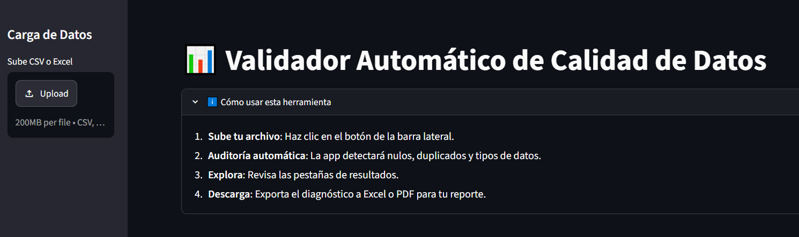
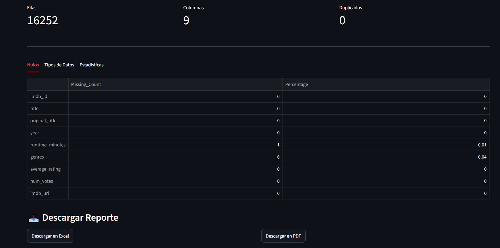

# 📊 Validador Automático de Calidad de Datos

Aplicación web profesional diseñada para automatizar la auditoría técnica de datasets (CSV/Excel). Esta herramienta permite a los equipos de datos validar la integridad de la información antes de procesos de carga o análisis, reduciendo significativamente el tiempo dedicado a la limpieza manual.

## 🖼️ Vista Previa

*Vista del dashboard mostrando métricas clave y análisis de nulos.*

[App Web]()

## 🖼️ Funcionamiento


## 🚀 Características Principales
- **Auditoría Técnica:** Detección automática de valores nulos, filas duplicadas y tipos de datos inconsistentes.
- **Análisis Estadístico:** Resumen descriptivo instantáneo de variables numéricas.
- **Reporte Multi-formato:** Exportación de resultados a **Excel** (para auditorías) o **PDF** (para presentaciones ejecutivas).
- **Interfaz Adaptable:** Diseño "Theme-aware" (modo claro/oscuro) construido con Streamlit para una experiencia de usuario óptima.
- **Arquitectura Modular:** Lógica de validación separada de la capa de visualización para facilitar futuras actualizaciones.

## 🛠 Stack Tecnológico
- **Lenguaje:** Python 3.10+
- **Framework:** Streamlit (UI)
- **Manipulación de Datos:** Pandas
- **Exportación:** XlsxWriter, FPDF
- **Despliegue:** Streamlit Community Cloud

## 📂 Estructura del Proyecto
```text
data-quality-validator/
├── app.py              # Interfaz de usuario (Streamlit)
├── src/                # Lógica central del negocio
│   ├── validator.py    # Motor de validación
│   └── utils.py        # Lógica de exportación
├── assets/             # Capturas de pantalla para documentación
├── requirements.txt    # Dependencias del proyecto
└── README.md
```

## 📦 Instalación
1. Clona el repo: `git clone https://github.com/JorgeHdzRiv/Validador-Calidad-Datos`
2. Cambia de ruta: `cd data-quality-validator`
3. Instala dependencias: `pip install -r requirements.txt`
4. Ejecuta la app: `streamlit run app.py`

## 🔒 Nota de Privacidad
Esta aplicación procesa los datos localmente en memoria. No se almacenan ni comparten archivos subidos con terceros, garantizando la confidencialidad de tu información.

## 👨‍💻 Sobre el Autor
Desarrollado como proyecto de portafolio para demostrar buenas prácticas de Ingeniería de Datos.